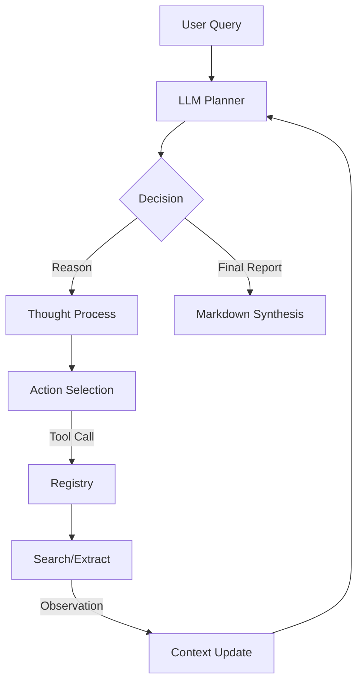

# 🧠 Smart Research Assistant

[](https://www.python.org/downloads/)
[](#core-concepts)
[](#philosophy)

> **A production-grade, zero-framework Agentic AI implementation designed for deep research synthesis.**

---

## 🚀 The Vision
In an era of LLM hallucinations and surface-level RAG, the **Smart Research Assistant** takes a different approach. Instead of simple vector retrieval, it employs a **ReAct (Reason + Act)** loop to autonomously navigate the web, cross-reference multiple sources, and synthesize high-fidelity research reports with academic-grade citations.

This isn't just a wrapper; it's a blueprint for building autonomous agents that actually *think* before they act.

## 🛠️ Key Differentiators
- **Zero Framework Bloat**: No LangChain, no CrewAI, no AutoGen. We use raw API calls to ensure maximum observability and minimum latency.
- **Dynamic Tool Registry**: A strictly-typed registry that handles OpenAI function schemas automatically.
- **Traceable Reasoning**: Every agent "Thought" is logged, providing a clear audit trail of why the agent took a specific action.
- **Contradiction Detection**: Engineered to flag when sources disagree, mimicking the critical thinking of a senior analyst.

## 🏗️ Technical Architecture
The system follows a classic **Agentic Loop** pattern:



## 💻 Getting Started

### Prerequisites
- Python 3.10 or higher
- [Deepseek API Key](https://platform.deepseek.com/)
- [Tavily API Key](https://tavily.com/) (Optimized for AI research)

### Quick Start
```bash
# Clone the repository
git clone https://github.com/Syedhuzaifa519/Smart-Research-Assistant.git
cd Smart-Research-Assistant

# Install dependencies
pip install -r requirements.txt

# Run the researcher
python main.py "Comparative analysis of Llama 3.1 vs. GPT-4o architecture"
```

## ⚙️ Configuration
Create a `.env` file in the root directory to manage your secrets:
```env
deepseak_API_KEY=sk-xxx
TAVILY_API_KEY=tvly-xxx
MODEL_NAME=deepseek-chat
MAX_ITERATIONS=10
```

## 📂 Project Structure
```text
├── agent/
│   ├── core.py       # The ReAct Agent Loop (The Heart)
│   ├── llm.py        # Resilient LLM Client with Retries
│   └── prompts.py    # High-precision System Prompting
├── tools/
│   ├── base.py       # Abstract Tool Interface & Registry
│   ├── search.py     # Tavily-powered Information Retrieval
│   └── extract.py    # URL Content Distillation
├── models/
│   └── schemas.py    # Pydantic Data Validation Models
└── main.py           # Polished CLI Interface
```

## 🗺️ Roadmap
- [ ] **Parallel Search Planning**: Dispatch multiple search queries simultaneously to reduce latency.
- [ ] **Recursive Depth Control**: Self-adjusting research depth based on query complexity.
- [ ] **Source Verification**: Grounding every claim against the Original URL content (beyond snippets).
- [ ] **Multi-Format Export**: PDF, HTML, and JSON report generation.

## 🎓 Philosophical Note
This project was built to demonstrate that **clean engineering > complex frameworks**. By understanding the raw loop of an agent, you gain the power to customize its behavior, optimize its costs, and ensure its reliability in production environments.

---
Built with ❤️ by [Syed Huzaifa](https://github.com/Syedhuzaifa519)
